1. Techmaster URLs:
- K8S Project Day Requirement: https://learn.techmaster.vn/learn/djgewerp/HobMtXxQ/WwigYv2E
- Obo Github: https://github.com/orez-fu/obo/tree/main

2. Commands:
- $ cd ~ && git clone <techmaster-devops-k8s> && cd ~/techmaster-devops-k8s/k8s_project_day
- $ chmod 755 make_docker_image_obo_project.sh
- $ export DOCKER_USERNAME=<our_docker_username> && ./make_docker_image_obo_project (We'll be required to input our docker username and password, then we'll work on the "<our_docker_username>/obo:v1" image).
- $ rm -rf obo
- $ minikube start --cpus=2 --nodes=2 --memory=2048 -p star
- $ minikube addons enable ingress -p star (This command will enable "ingress" for the "star" profile in minikube - [K8S Ingress Minkube Wiki](https://kubernetes.io/docs/tasks/access-application-cluster/ingress-minikube/))
- $ minikube profile list
---
- $ kubectl create configmap mysql-init-file --from-file ./init_mysql_data/obo.sql
- $ kubectl apply -f ./templates/obo_config.yaml && kubectl apply -f ./templates/mysql_config.yaml && kubectl apply -f ./templates/db_deployment.yaml
- $ kubectl get pods -o wide (Before executing next commands, please wait at least 20 seconds to help MySQL finish initializing the _obo_ database and its respective tables).
- $ kubectl apply -f ./templates/app_deployment.yaml (We should run this app_deployment after MySQL in db_deployment is running more than 20 seconds)
- $ kubectl apply -f ./templates/ingress.yaml (We have to wait more than 40 seconds for the ingress to start running. The given host is "www.quoctran.com"). 
- $ kubectl get nodes,services,deployments,secrets,configmaps,pods,ingress -o wide
---
- $ curl --resolve "www.quoctran.com:80:$(minikube ip -p star)" -i http://www.quoctran.com (This command will print the obo website html content through the provided ingress).
- (Optional) To run the _"curl http://www.quoctran.com"_ command instead of the command above, we need to run the _"minikube ip -p star"_ command to get minikube IP address first, then add this string _"<minikube_ip> www.quoctran.com"_ to this system file _"/etc/hosts"_.
---
- $ kubectl port-forward svc/obo-service 31000:8080 --address 0.0.0.0 (We'll public the port 31000 for obo-service which is binded with the 0.0.0.0 address)
- We can access our new website through the AWS EC2 public IPv4 DNS (Please don't use "https" because we haven't supported the SSL/TLS certificate yet):
  - http://ec2-18-138-224-3.ap-southeast-1.compute.amazonaws.com:31000/
  - http://ec2-18-138-224-3.ap-southeast-1.compute.amazonaws.com:31000/admin
  - We can try these accounts to login:
    - Admin (Username: admin@obostadium.com | Password: 123456)
    - Memory (Username: monguyen@gmail.com | Password: 123456)
---
To access our MySQL pod to execute any DDL or DML queries:
- $ kubectl exec -it <mysql_pod_name> -- sh
- $ ls -l /docker-entrypoint-initdb.d (To view the file used to initialize MySQL database).
- $ ls -l /var/lib/mysql (To view the generated database folder). 
- $ mysql -u root -h localhost -p (To access MySQL with the root user and the given _"mysql"_ password which was provided in the MYSQL_ROOT_PASSWORD config key).
- $ use obo; (Use "obo" database name).
- $ show tables; (Show all tables in the given database).
- $ select * from users; (To view a list of users in the "users" table).
- $ exit (Exit the current MySQL session).
- $ exit (Exit the current pod session).
---
- $ kubectl delete configmap mysql-init-file
- $ kubectl delete -f ./templates

3. Result images:
  - 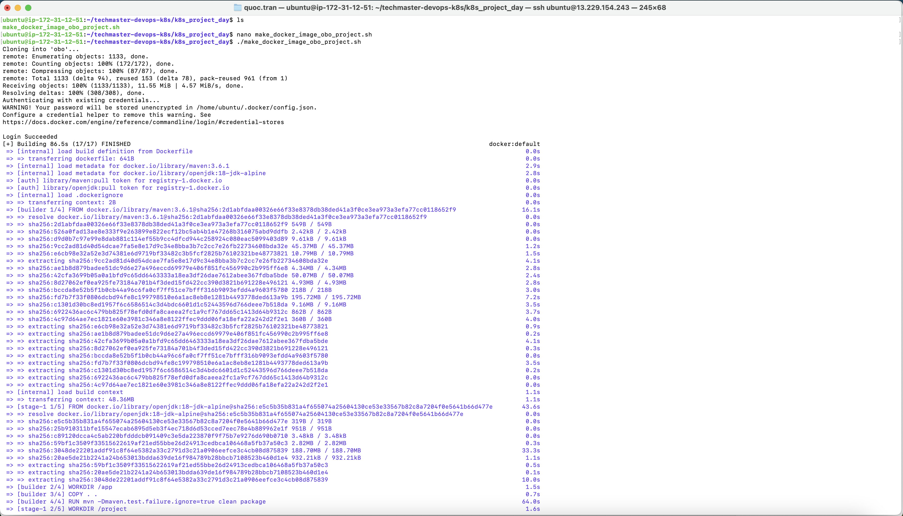
  - 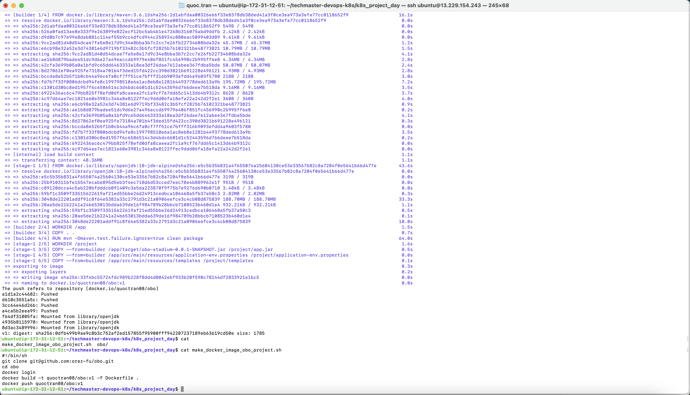
  - 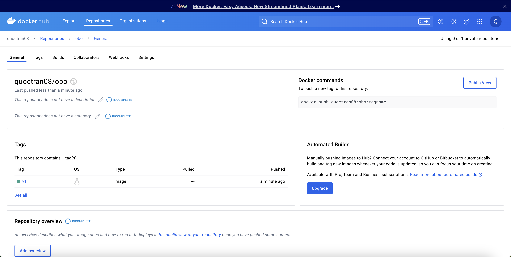
  - 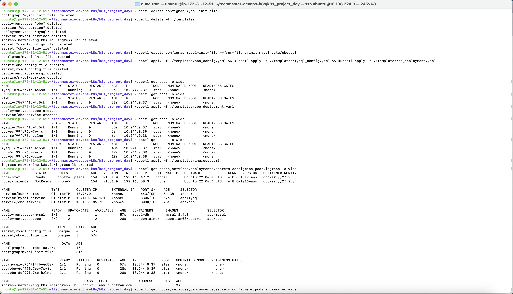
  - 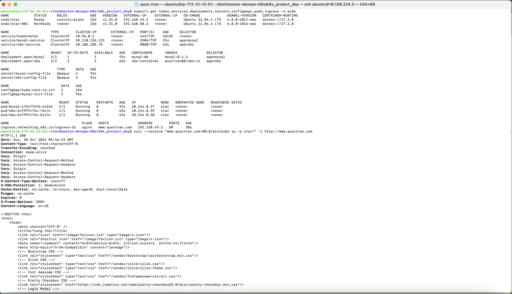
  - 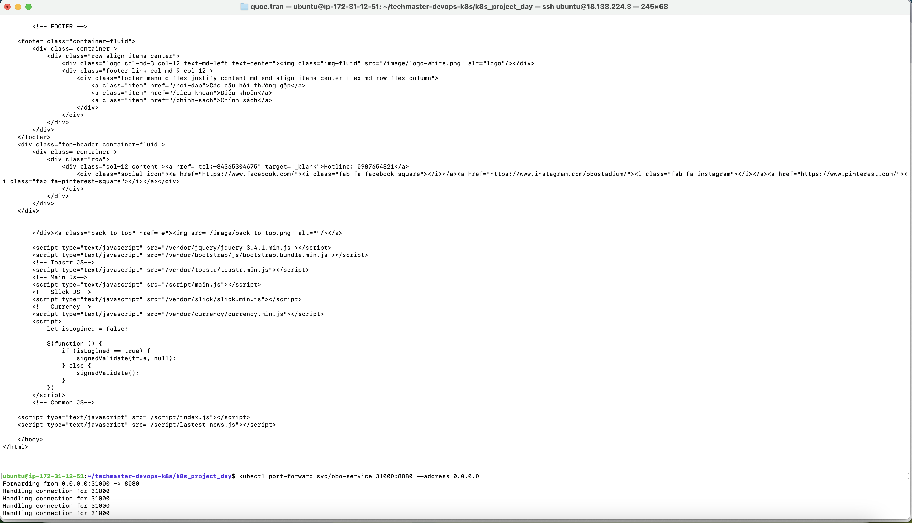
  - 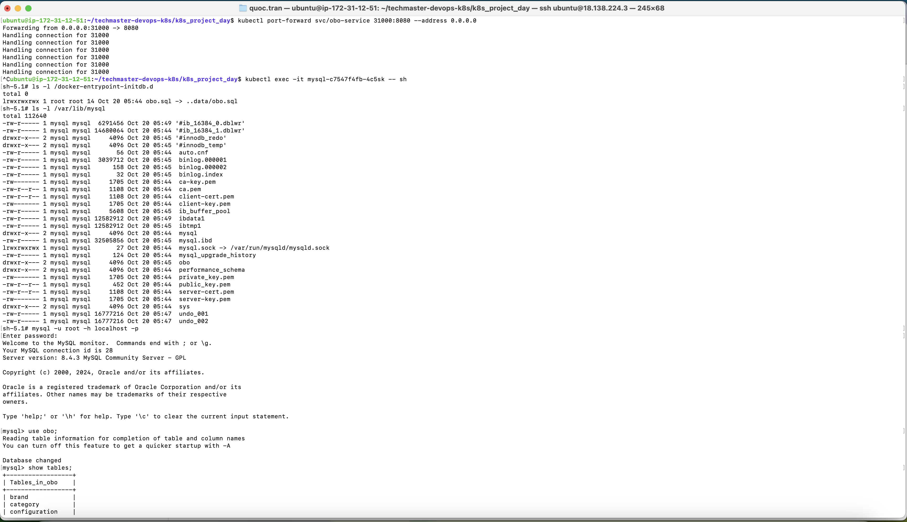
  - 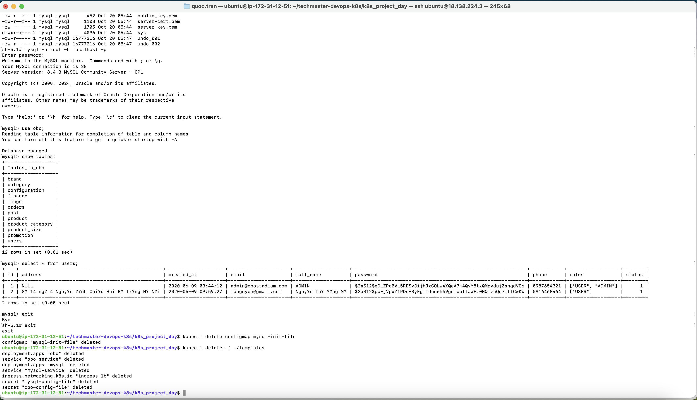
  - 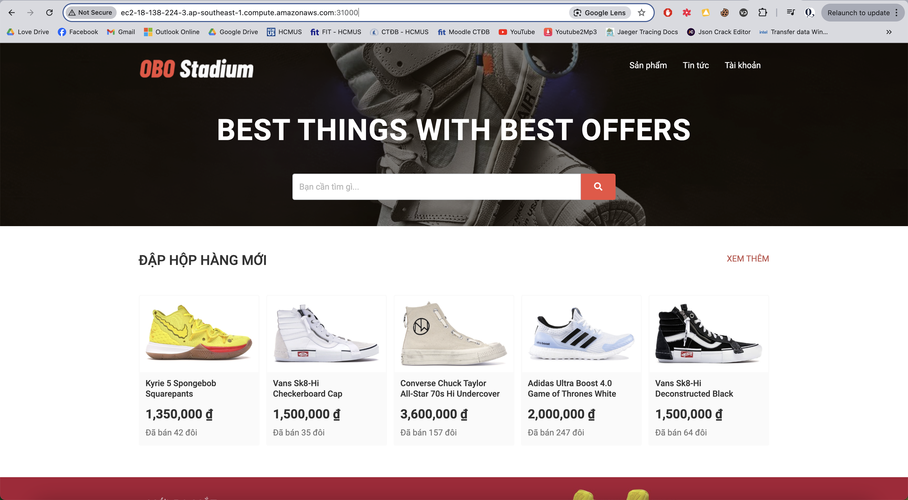
  - 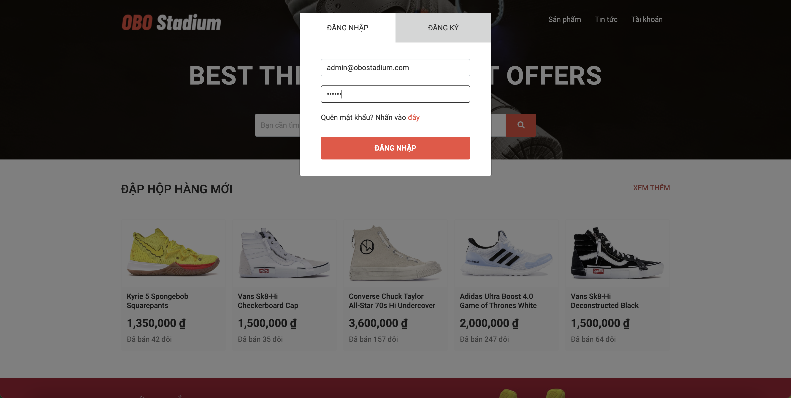
  - 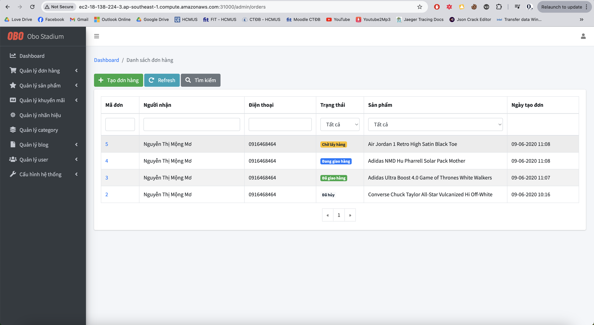
  - 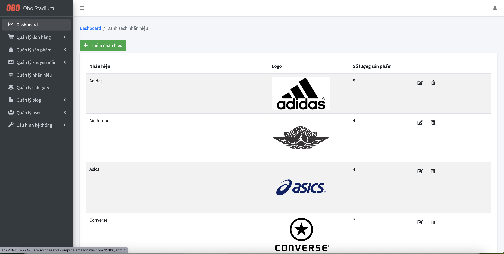
  - 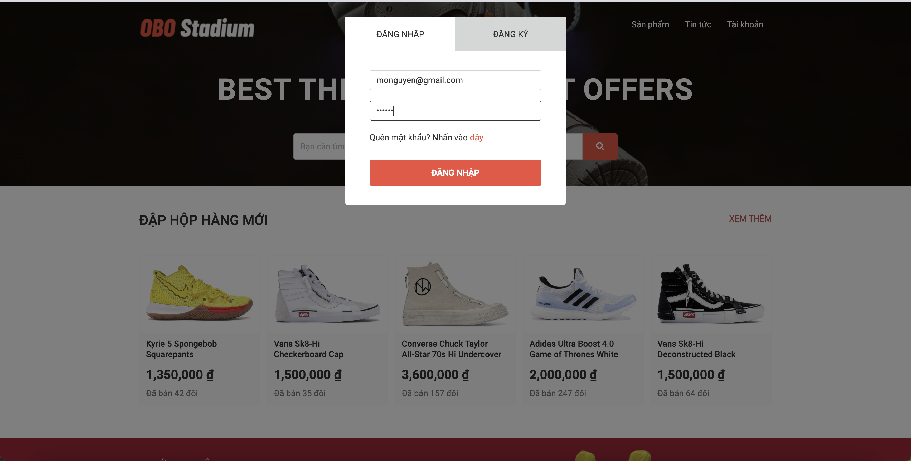
  - 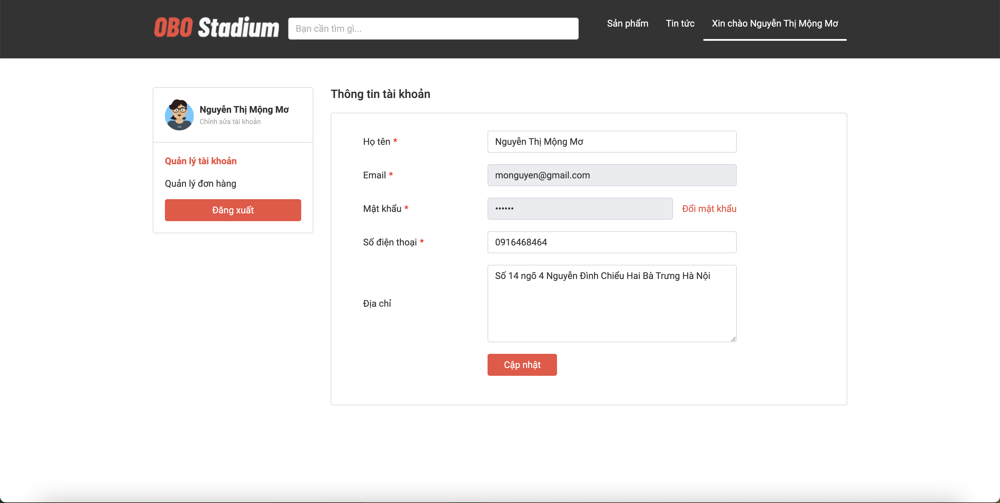
  - 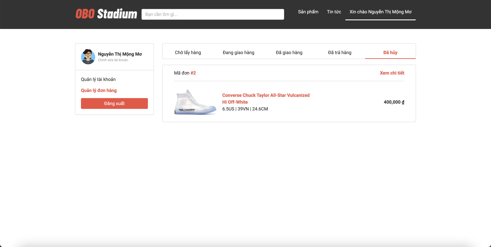
  - 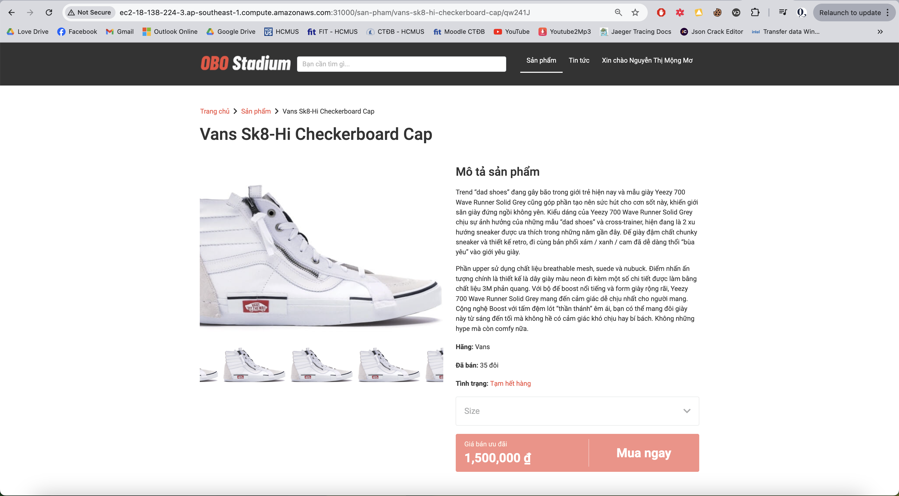
