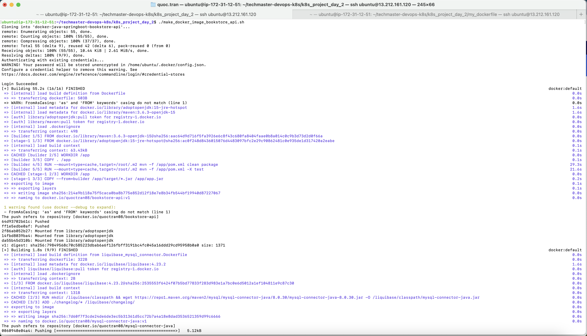
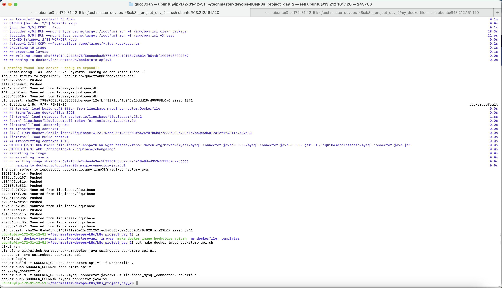
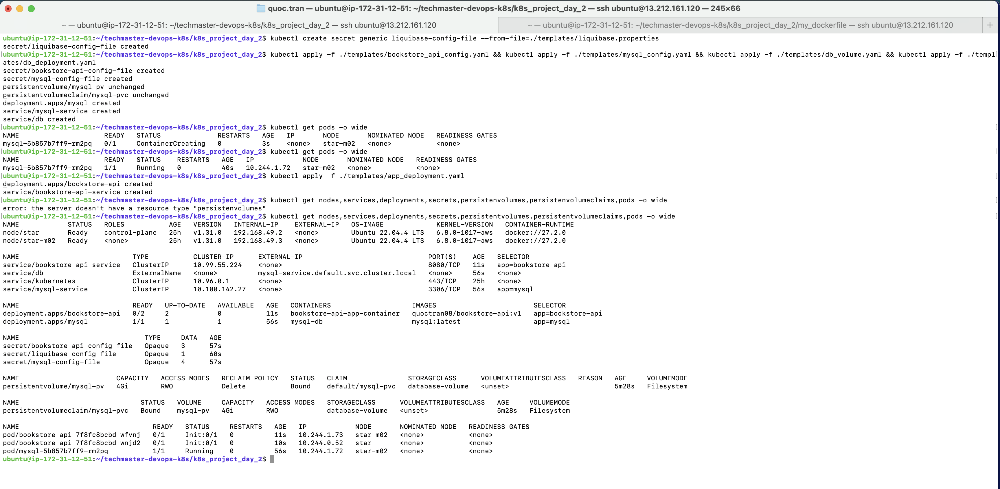
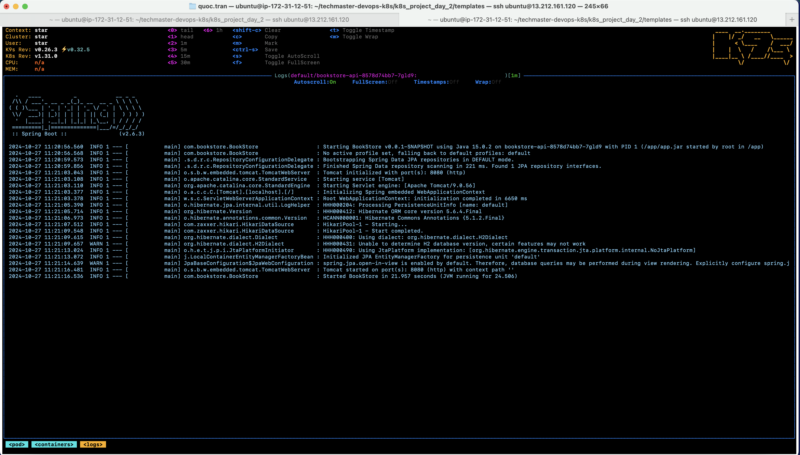
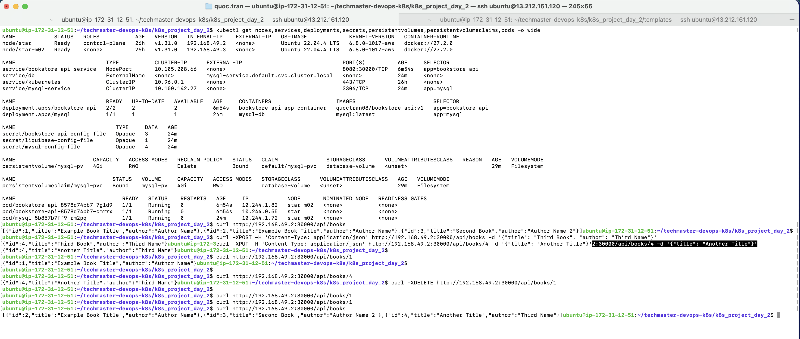

1. Techmaster URLs:
- K8S Project Day Requirement: https://learn.techmaster.vn/learn/djgewerp/HobMtXxQ/WwigYv2E
- Java Springboot Bookstore API Github: https://github.com/ruanbekker/docker-java-springboot-bookstore-api/blob/main/README.md 

2. Commands:
- $ cd ~ && git clone git@github.com:1653072/techmaster-devops-k8s.git && cd ~/techmaster-devops-k8s/k8s_project_day_2
- $ chmod 755 make_docker_image_bookstore_api.sh
- $ export DOCKER_USERNAME=<our_docker_username> && ./make_docker_image_bookstore_api (We'll be required to input our docker username and password, then we'll work on the "<our_docker_username>/bookstore-api:v1" and "<our_docker_username>/mysql-connector-java:v1" images).
- $ minikube start --cpus=2 --nodes=2 --memory=2048 -p star
- $ minikube profile list
---
- $ kubectl create secret generic liquibase-config-file --from-file=./templates/liquibase.properties
- $ kubectl apply -f ./templates/bookstore_api_config.yaml && kubectl apply -f ./templates/mysql_config.yaml && kubectl apply -f ./templates/db_volume.yaml && kubectl apply -f ./templates/db_deployment.yaml
- $ kubectl get pods -o wide (Before executing next commands, please wait at least 25 seconds to help MySQL finish initializing the books_db database).
- $ kubectl apply -f ./templates/app_deployment.yaml (We should run this app_deployment after MySQL in db_deployment is running more than 20 seconds)
- $ kubectl get nodes,services,deployments,secrets,persistentvolumes,persistentvolumeclaims,pods -o wide
---
- $ curl http://MinikubeIP:NodePort/api/books (Please replace NodePort by 30000 which was configured in ./templates/app_deployment.yaml)
- $ curl -XPOST -H 'Content-Type: application/json' http://MinikubeIP:NodePort/api/books -d '{"title": "First Book", "author": "Author Name"}'
- $ curl -XPUT -H 'Content-Type: application/json' http://MinikubeIP:NodePort/api/books/1 -d '{"title": "Another Title"}'
- $ curl http://MinikubeIP:NodePort/api/books/1
- $ curl -XDELETE http://MinikubeIP:NodePort/api/books/1
---
- $ kubectl delete secret liquibase-config-file 
- $ kubectl delete -f ./templates/bookstore_api_config.yaml && kubectl delete -f ./templates/mysql_config.yaml && kubectl delete -f ./templates/db_deployment.yaml && kubectl delete -f ./templates/app_deployment.yaml && kubectl delete -f ./templates/db_volume.yaml

3. Result images:
  - 
  - 
  - 
  - 
  - 
