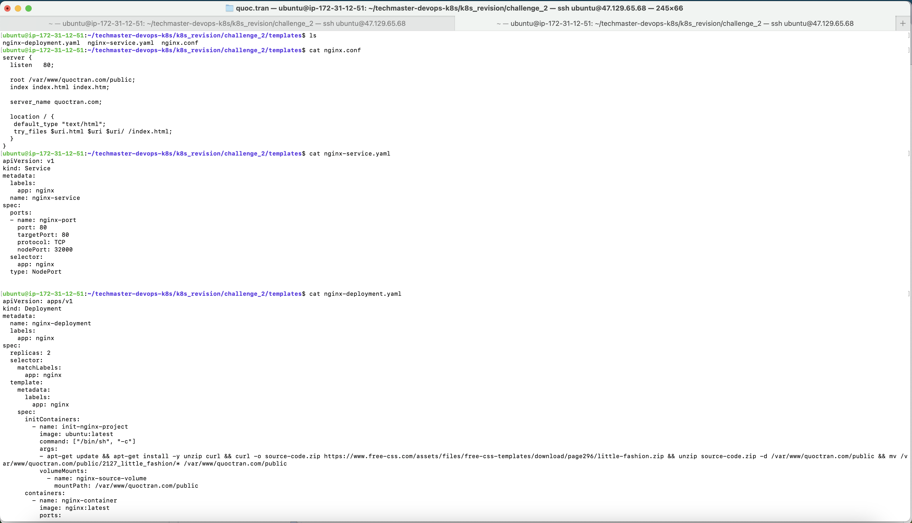
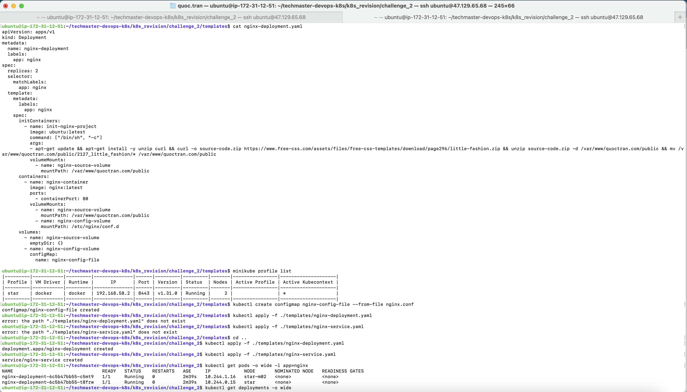

1. Techmaster Exercise URL: https://learn.techmaster.vn/lop-hoc/djgewerp/bai-tap?id=310163
2. Let's start with this static website: https://www.free-css.com/free-css-templates/page296/little-fashion
3. Commands:
- $ nano nginx-deployment.yaml (We can use the existing one in ./templates/nginx-deployment.yaml). The current replica quantity is 2.
- $ nano nginx-service.yaml (We can use the existing one in ./templates/nginx-service.yaml). The current NodePort is 32000.
- $ nano nginx.conf (We'll update the current Nginx config by this new config file. Note that we'll use this "quoctran.com" server name with the root path "/var/www/quoctran.com/public")
- $ minikube start --cpus=2 --nodes=2 --memory=2048 -p star
- $ minikube profile list
- $ kubectl create configmap nginx-config-file --from-file nginx.conf
- $ kubectl apply -f ./templates/nginx-deployment.yaml
- $ kubectl apply -f ./templates/nginx-service.yaml
- $ kubectl get pods -o wide -l app=nginx
- $ kubectl get deployments -o wide
- $ kubectl get replicaset -o wide
- $ kubectl get services -o wide
- $ kubectl get nodes -o wide
- $ curl http://<SELECT_ONE_NODE_IP_ADDRESS>:32000 (We're calling to the Nginx through the NodeIP and NodePort above).
- $ minikube ssh -p star -n <ANY_NODE_NAME>
- $ -> curl localhost:32000 (We're calling to the Nginx through the NodePort above).
- $ -> curl http://127.0.0.1:32000 (We're calling to the Nginx through the NodePort above).
- $ -> curl http://<SELECT_ONE_POD_IP_ADDRESS>:80 (We're calling to the Nginx through the Pod port inside the current cluster with the same default namespace).
- $ -> exit
- $ kubectl port-forward <POD_NAME> 31000:80 --address 0.0.0.0 (We'll public the port 31000 which is binded with the 0.0.0.0 address)
- We can access our new website through the AWS EC2 public IPv4 DNS: http://ec2-47-129-65-68.ap-southeast-1.compute.amazonaws.com:31000/ 
- $ kubectl delete -f ./templates/nginx-deployment.yaml
- $ kubectl delete -f ./templates/nginx-service.yaml
- $ kubectl delete configmap nginx-config-file
4. Result images:
  - 
  - 
