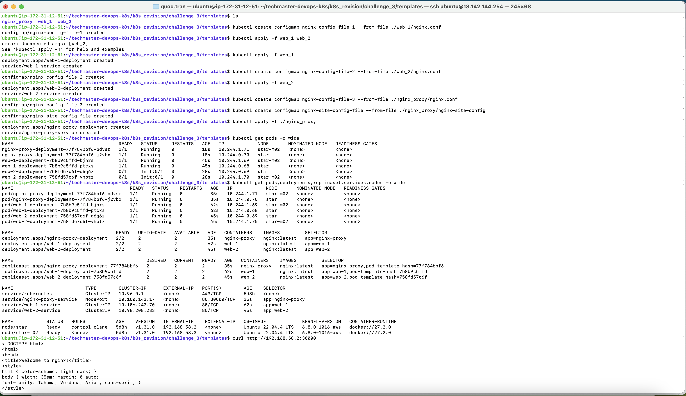
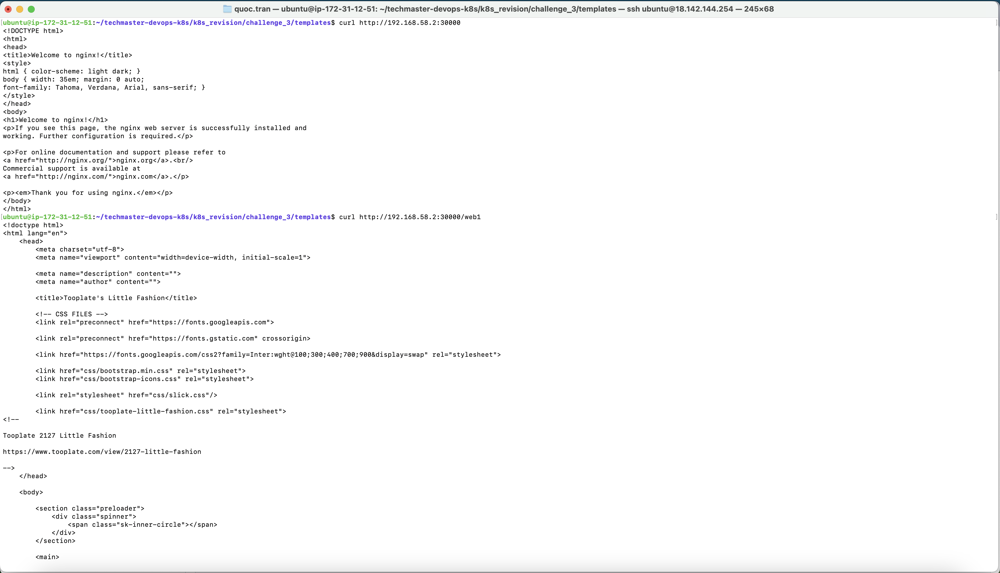
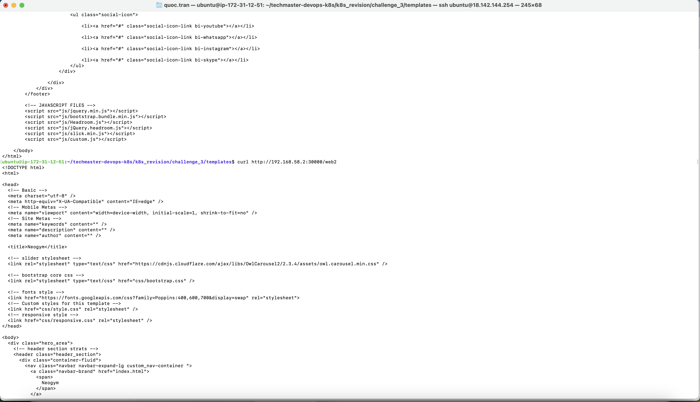
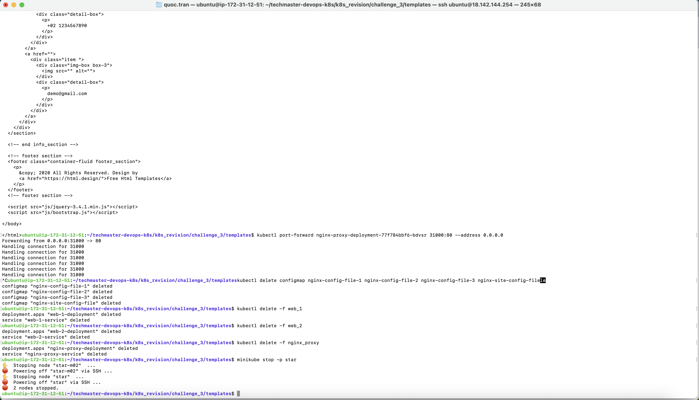
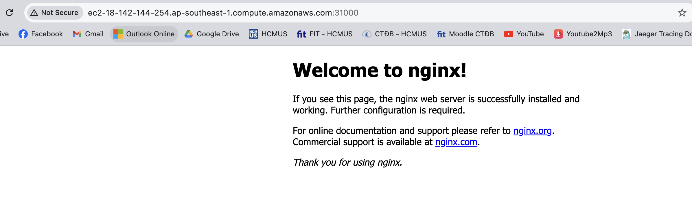
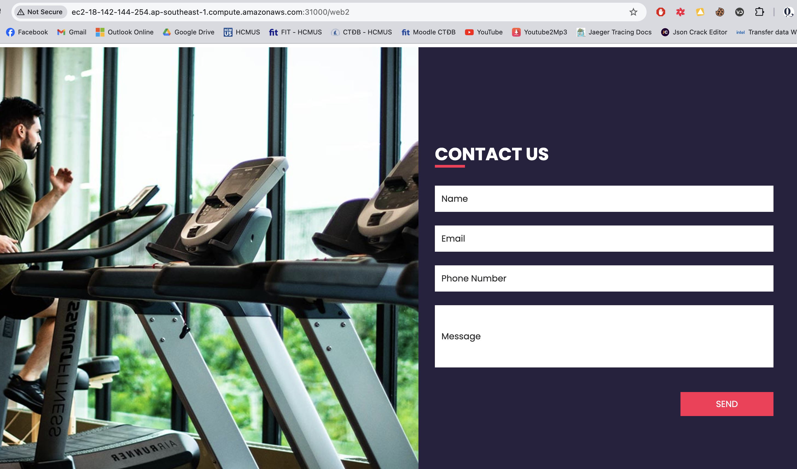

1. Techmaster Exercise URL: [https://learn.techmaster.vn/lop-hoc/djgewerp/bai-tap?id=310163](https://learn.techmaster.vn/lop-hoc/djgewerp/bai-tap?id=310162)
2. Let's start with these static website:
- https://www.free-css.com/free-css-templates/page296/little-fashion
- https://www.free-css.com/free-css-templates/page296/neogym
4. Commands:
- $ cd ~/techmaster-devops-k8s/k8s_revision/challenge_3/templates
- $ minikube start --cpus=2 --nodes=2 --memory=2048 -p star
- $ minikube profile list
- $ kubectl create configmap nginx-config-file-1 --from-file ./web_1/nginx.conf
- $ kubectl apply -f web_1
- $ kubectl create configmap nginx-config-file-2 --from-file ./web_2/nginx.conf
- $ kubectl apply -f web_2
- $ kubectl create configmap nginx-config-file-3 --from-file ./nginx_proxy/nginx.conf
- $ kubectl create configmap nginx-site-config-file --from-file ./nginx_proxy/nginx-site-config
- $ kubectl apply -f nginx_proxy (Service will have the NodePort by 30000)
- $ kubectl get pods,deployments,replicaset,services,nodes -o wide
- $ curl http://<SELECT_ONE_NODE_IP_ADDRESS>:30000 (We're calling to the Nginx through the NodeIP and NodePort above).
- $ curl http://<SELECT_ONE_NODE_IP_ADDRESS>:30000/web1 (Get static web 1).
- $ curl http://<SELECT_ONE_NODE_IP_ADDRESS>:30000/web2 (Get static web 2).
- $ kubectl port-forward <NGINX_PROXY_POD_NAME> 31000:80 --address 0.0.0.0 (We'll public the port 31000 which is binded with the 0.0.0.0 address)
- We can access our new website through the AWS EC2 public IPv4 DNS (Please don't use "https" because we haven't supported the SSL/TLS certificate yet):
  - http://ec2-47-129-65-68.ap-southeast-1.compute.amazonaws.com:31000/
  - http://ec2-47-129-65-68.ap-southeast-1.compute.amazonaws.com:31000/web1
  - http://ec2-47-129-65-68.ap-southeast-1.compute.amazonaws.com:31000/web2 
- $ kubectl delete configmap nginx-config-file-1 nginx-config-file-2 nginx-config-file-3 nginx-site-config-file
- $ kubectl delete -f web_1 
- $ kubectl delete -f web_2
- $ kubectl delete -f nginx_proxy
- minikube stop -p star
4. Result images:
  - 
  - 
  - 
  - 
  - 
  - 
  - 
